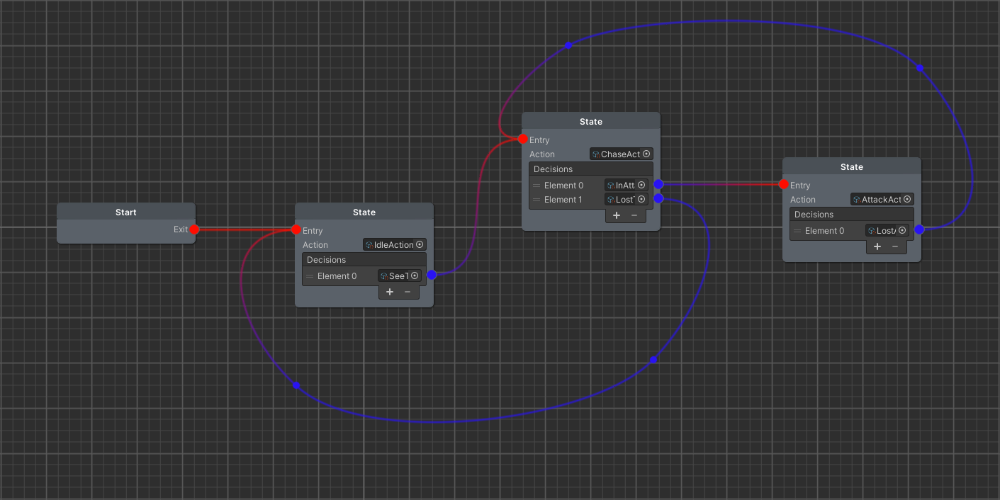
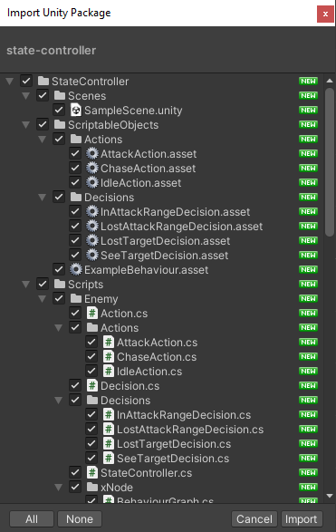
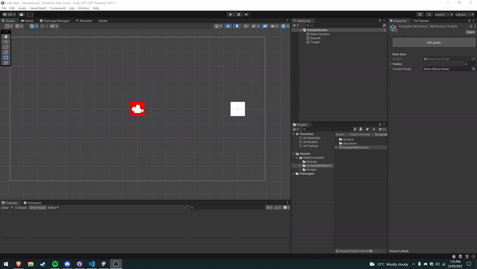
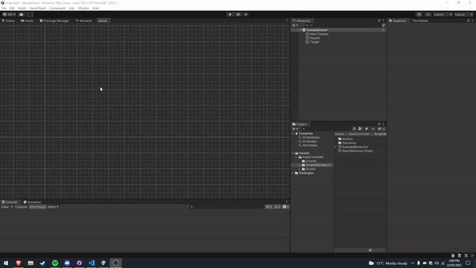
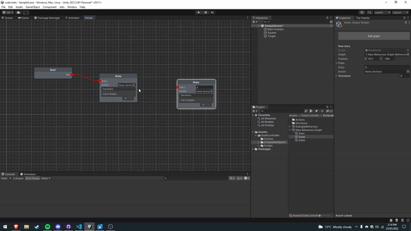
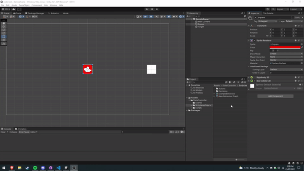
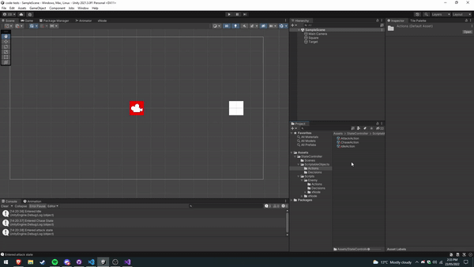

# Enemy State Controller

A node-based state controller for setting up enemy behaviours in unity. Create new state nodes and add your own actions and conditions to them in a node editor. The state controller will move between connected nodes depending on conditions that you have set on each node.

You can create your own actions and conditions(decisions) to add to these nodes - more info below.



## Download
<details><summary>Download & Installation</summary>

[Download](https://github.com/Kzzkt147/enemy-state-controller/releases)

### Installation
Download the unity package and import it into your unity project. <br>

</details>
<br>

# How to Use

## Setting up nodes

1. Create a new behaviour graph in your project folder **(Create>BehaviourGraph)**. <br>


2. Inside the graph, right click to add state nodes. Connect a start node to the state node that the enemy will begin on. <br>


3. Assign an action to the state node and add as many decisions as needed. Actions will dictate what the state controller does when the state is active, and decisions are conditionals - when they are met, it will switch the connected state.<br>


4. Assign the graph we just created to a state controller component placed on an enemy.<br>


## Creating Actions and Decisions

### Actions
Create a new script and inherit your class from the abstract 'Action' class, making sure to implement the abstract methods from 'Action'. Because this is a scriptable object, add a 'CreateAssetMenu' attribute and create an instance of the class as an object.
```cs
[CreateAssetMenu(menuName = "Enemy/Actions/ExampleAction", fileName = "ExampleAction")]
public class ExampleAction : Action {

    public override void StartActions(StateController controller) {
        // this code will run when we enter the state.
    }

    public override void UpdateActions(StateController controller) {
        // this code will update every frame that the state is running.
    }

    public override void FixedUpdateActions(StateController controller) {
        // this code will update every physics update that the state is running.
    }
}
```


### Decisions
Create a new script and inherit your class from the abstract 'Decision' class, making sure to implement the abstract methods from 'Decision'. Because this is a scriptable object, add a 'CreateAssetMenu' attribute and create an instance of the class as an object.
```cs
[CreateAssetMenu(menuName = "Enemy/Decisions/ExampleDecision", fileName = "ExampleDecision")]
public class ExampleDecision : Decision {
    public override bool HandleDecision(StateController controller) {
        // this should contain conditional code that will return true or false. 
        return false;
    }
}
```

### Extra Notes
Each action and decision is s scriptable object - meaning that if two enemies share the same action as behaviour, they are sharing the same instance of that script. To make sure there are no conflicts in their behaviour, do not create any new variables in these scripts and should instead be taking everything from the state controller.
